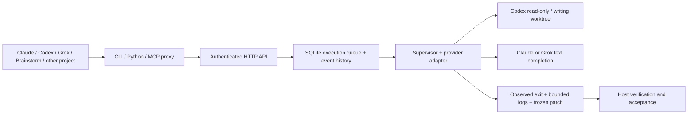

# 设计决定

## 控制边界

业务 task、执行 run、provider session 是三个对象。宿主把自身 ID 放进 `caller_task_id`，服务生成不可复用的 run ID，再记录 provider 返回的 session ID、工作目录、base revision、argv、输出与事件。服务不重写 Brainstorm 的 events，也不充当 scaffold task 文件的第二个写入者。

一次 run 是一次有界执行。状态由 `queued` 到 `running`，再到 `succeeded/failed/cancelled/timed_out/interrupted`。验收是另一列 `pending/accepted/rejected`。非零退出、超时或服务中断的 run 不能被标记 accepted。结果文本或模型自己写出的 receipt 都不能覆盖监督器观察到的退出结果。

## 角色拆分

Owner 留在宿主，拥有问题定义、跨模块设计、预算、集成和最终验收。Scout 只找事实，交付路径、证据和未知点；worker 接已经确定的具体修改；debugger 解决复现和根因不明的独立问题；reviewer 对结果和可复现反例负责。角色是责任，不等于某个永久模型 ID。

模型/effort、权限、任务用途分别配置。新服务保留旧别名，默认写角色收紧为 worktree。对两个几分钟的小问题没有必要排两个长 agent；低/中 effort 默认 owner 自己做。高 effort 仅把可独立推进的切片派出，不能把总体架构或最后“是否完成”交给子任务。先写出 brief 的范围、排除项、完成条件、检查命令，再选择最小能胜任的角色。

Leaf worker 禁止再派工。服务给子进程设置 `AGENT_EXEC_CHILD=1`，Client 拒绝子进程 submit/retry，并在 Codex per-run 配置里关闭 multi_agent 与 agent_exec MCP。这是操作规约，不能对抗同 UID 恶意代码。第一版不引入自动扩展 DAG、模型路由模型、agent 辩论或自动纠错循环。

## 持久性与资源

SQLite WAL 保存执行状态与单调递增事件，文件锁确保唯一调度器。有界 FIFO 队列、并发上限、每次超时和输出限额，服务端决定可用角色、工作目录、可执行文件。API 拒绝任意 argv、shell、env、cwd 和未注册 workspace。

提交幂等键对同一 JSON body 生效；请求键顺序不影响哈希，省略字段与显式默认值不保证视作同一 body。重试需要明确调用，会建立新 run。角色/可执行文件/工作目录映射变化时拒绝沿用旧 run 重试；写任务沿用最初 base revision。读任务针对当时文件系统，不提供文件内容快照。

父进程和执行 shim 各在明确进程组内工作。Linux `PR_SET_PDEATHSIG` 清理意外失去监督器的子进程；安装后的 systemd 单元用 cgroup 清理服务后代。重启匹配 PID 的 start ticks 和 boot ID，不能仅凭陈旧 PID 去杀进程。退出观察使用 `waitid(WNOWAIT)`，在清理所属进程组之前保留 group leader PID，避免 PID 复用。脱离进程组的恶意后代仍需要 OS 沙箱/cgroup 的更强隔离。

取消在终态提交前生效；如果外部副作用已经发生，cancel 并不撤销它。服务重启把未完 running 记为 interrupted，queued 保留。明确重试比自动推断“应该再跑一次”可靠。HTTP caller 等待超时只停止等待；Brainstorm adapter 拥有它发出的 run，所以在自己的截止时间后明确取消该 run。

## 写入和 review

新写任务要求注册 Git 根目录允许写、原目录干净，执行于 `.worktrees/agent-exec/RUN_ID`。不会快照、提交或重置用户的 dirty 工作。原 legacy snapshot/adopt 流程独立保留，选择它时沿用原权限和行为，不能把新服务的默认权限保证套到 legacy 上。

运行后从 pinned base 导出 tracked+untracked patch，不修改用户 index。patch 有大小限额、SHA256 和无损编码，另保留 worktree。未导出完整 patch 时记录 artifact_error，owner 应检查工作目录。默认不自动 adopt/删除：这样中断或失败仍可调查。需清理时先保存证据和确认自己的目录，再用 `git worktree remove`。

API token 的持有者有相同执行/查看/取消权限。verdict 表示 token caller 的验收声明，不是独立身份或不可篡改审计。强控制面隔离需要另一个 OS 身份、容器/namespace、隔离凭据和可校验的外部 supervisor；不能靠多加一份 model-writable JSON 达成。

## Provider 和宿主边界

Codex 采用官方 non-interactive `exec --json`，读取 `thread.started` 和最终 agent_message，使用明确 sandbox 与禁用嵌套 agent 的设置。Claude 使用 print JSON、safe-mode 和空 tools；Grok 使用 prompt-file JSON、空 tools、no-subagents、拒绝工具权限。Claude/Grok 第一版提供 completion，不提供完整代码 agent 的可写模式。

各 provider 调用会产生实际费用/配额消耗；v1 超时、并发和输出限制已经生效，token/cost 预算没有统一强制接口，不能把配置秒数称为花费上限。旧配置中的 probe 只说明 CLI 可启动，不代表认证、模型可用或真实任务成功。

MCP/Skill 可以让宿主主动选择外部执行，不能把一个服务 run 伪装成原生 child thread。原生 fork/context/message injection、内存管理和 UI 留在宿主。若以后维护 Codex 源码 fork，应在独立 upstream checkout 里为 spawn/wait/result/cancel 做适配层，把 external run ID 映射到宿主 tool result，同时明确不支持的 thread 消息语义；不得直接编辑 npm 中的编译二进制。先用 MCP 的实际使用证据判断是否需要 fork。

Brainstorm Council 继续做独立发言、互评和主席整合。adapter 只替换 `Provider.complete`：外部 run IDs 可由 `on_run` 回调写入宿主现有的 API 事件；不会自行写入 session 文件。`prompt_only=True` 只用于完整提示词，并执行在服务端注册的空 scratch workspace，不能假设另一 PC 的 cwd 文件被同步。研究来源校验和 TODO 自动执行尚未迁移。

## 后续扩展的触发条件

- 真有多用户共享需求，再做每客户端 token/权限、独立 OS 用户和不可绕过的文件系统/网络隔离。
- 确有大量输出/长连接需求，再做带 cursor 的 SSE 和 artifact 对象存储；现有事件轮询已经可恢复。
- 确有嵌套任务/依赖需求，再在宿主或一个权威任务库里做 DAG，执行服务仍只管 run。
- 有 provider-specific 流式续谈需求，再定义 resume/follow-up/message 语义和测试；当前每次是新执行，旧 runner 的 resume 仍在 legacy 入口。

官方接口依据（本次已读取，并用本机 CLI help 交叉核对）：

- https://developers.openai.com/codex/non-interactive-mode
- https://developers.openai.com/codex/developer-commands
- https://developers.openai.com/codex/extend/mcp
- https://developers.openai.com/codex/configuration
