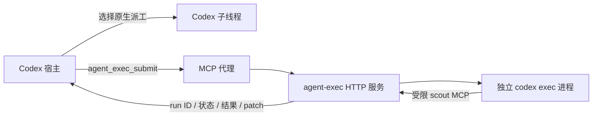

# Codex 接入与原生子代理的区别

agent-exec 通过 Codex 已支持的 MCP 和 Skill 接口接入。宿主选择任务、准备
brief 和验收结果；agent-exec 管理有界执行、任务队列、worktree 和产物。
无需修改 Codex 源码、模型路由实现或内置 `spawn_agent` 工具。

## 使用方式

1. 按 [MCP 模板](../examples/codex-mcp.toml) 配置 `agent_exec`，安装本项目
   [Skill](../skills/agent-exec/SKILL.md)，并确保服务启动。已经安装时无需重复配置。
2. 在新会话里明确选择外部派工。示例指令：

   > 本任务使用 agent-exec Skill。通过 agent_exec MCP 派工，先查询 capabilities
   > 获取 workspace 和角色。scout 只读取证；worker 执行已确定的修改；debug
   > 排查复杂失败；reviewer 独立审查；gate 检查完成声明的证据。每份 brief
   > 给出目标、范围、禁止改动、完成条件和检查命令，并填写 caller_task_id。
   > 先提交相互独立的任务，再统一查询状态和结果；写任务各用服务创建的
   > worktree，由当前宿主审核 patch 和验收。需要的子任务继续派只读 scout。

3. 宿主调用 `agent_exec_capabilities`，然后 `agent_exec_submit`。提交立即返回
   run ID；宿主用 `agent_exec_status/events/result/diff` 收集证据，需要时用
   `agent_exec_cancel`。MCP 没有自动采纳 patch 或最终验收工具。
4. 如果当前会话没有挂载新 MCP，重开会话使配置被载入，或使用已有的
   `agent-exec task submit/show/wait/result/diff` CLI。查询返回的实例和
   `source_sha256` 可确认所用服务版本；仅看到 Skill 正文不证明服务已更新。

Skill/AGENTS 中的路由约定是给模型的指令，不能拦截或重新实现原生 spawn。
两套工具同时存在时，宿主仍可能选错通道；brief、caller_task_id 和结果里的
run ID 用于核对实际走的是哪套机制。子进程中的原生 multi-agent 禁用及
scout MCP 是按次 `codex exec` 参数，宿主的原生设置保持独立。

宿主通过主 MCP 提交的任务属于 depth 0，默认十个顶层任务可同时运行。
服务内继续派的 scout 属于后续深度，每层十个共享槽位；两层嵌套时总上限
为三十个进程。这个上限与 Codex 原生线程配置独立。

## 两套机制的区别

| 项目 | Codex 原生子代理 | agent-exec |
|---|---|---|
| 单位 | Codex 内部维护的 agent thread | SQLite 中的 run 和独立 provider 进程 |
| 上下文 | 由 native spawn/fork 和宿主线程机制管理 | 仅显式 goal/context、brief 及实际 cwd；不自动复制宿主对话 |
| 交互 | 可发后续指令、等待、停止、查看/关闭线程 | 当前一次 run 一次执行；查询/取消可用，retry 创建新 run；无持续 follow-up API |
| 模型与角色 | 官方 custom agent 配置可设置模型、推理强度和 sandbox | 服务角色注册表集中配置；写角色由服务创建 worktree |
| 权限 | 继承父线程运行时 sandbox/approval，再应用角色设置 | HTTP 认证、已注册 workspace、provider sandbox 和受限 child API；不继承宿主交互式权限变化 |
| 并发 | `agents.max_concurrent_threads_per_session` 控制原生子线程数，不含主线程 | 顶层和 scout 各深度的进程池；与原生线程上限无关 |
| 取消 | 宿主直接管理其线程与交互 | 服务监督进程；后代 run 随父 run 终止请求取消，实际退出异步完成 |
| 产物 | 子线程输出与宿主工具结果 | 持久状态、日志、退出码、patch SHA256、独立执行/验收状态 |
| 跨项目/跨 PC | 依 Codex 宿主与当前运行环境 | HTTP/MCP/CLI 共用本机服务；任务在服务登记的工作目录执行 |

宿主会话结束不等于取消一个外部顶层 run。依赖该语义的宿主适配器应明确
在停止时调用 cancel；新 child scope 的级联取消只关联服务内的父子 run。
在另一台 PC 上提交不会自动同步那台 PC 的工作目录或未提交文件。

原生 custom agents 已能直接选 scout/worker 所需模型。因此“只想更换原生
子代理的模型和 prompt”可以走官方配置。需要统一生命周期、跨项目 HTTP
调用、持久证据、外部 provider 或独立 worktree 时，外部服务更有用。

## 原来的 Haiku 驱动方式

旧 Claude agent 定义指定 `model: haiku`、`tools: Bash`，让 Haiku 写下 Task
brief 后调用 `codex-exec dispatch --profile build --task-file ...`，等待后将
digest 转交给 Claude。真正实施工作的是外部 Codex，Haiku 是执行驱动。
这是有效的兼容适配，但有以下代价：

- 多一次模型调用和等待循环，也多了 brief 落盘、转述或驱动指令执行失败的可能。
- 工作者从零开始，只收到写下的 brief；宿主先前读过的文件、约束和讨论不自动传递。
- 外层 Claude 任务结束不等于外部 detached supervisor 已停止；旧 driver 主要
  dispatch/finish/wait，没有正常路径上的自动 cancel。
- 外层 Haiku 的 Bash 权限不等于内部 Codex 的 sandbox 权限。旧 profile 路径的
  WORKTREE 由 brief 控制，runner 默认 sandbox 配置为 yolo；不能仅凭 agent
  名称或 `writes: tree` 判断执行已隔离。
- 看起来是 Claude 子代理，实际业务状态在外部 job 中；需要同时排查两边。
  透传 digest 也不构成验收证明。

本项目保留 legacy 文件用于兼容和追溯，未把旧路由、旧模型表或 hook 自动
迁移到新 task API。新 MCP 的好处是宿主直接调用确定性的提交/查询接口，
不用再找一个模型专门代执行 shell 等待。但上下文传递和宿主最终验收仍需明确。

## 官方文档

核对日期：2026-10-02。官方文档当前说明原生 agent thread、follow-up、
父线程权限继承、自定义 agent 和并发配置；内部工具 schema 依版本变化，
不能把 MCP run ID 当作原生 agent ID 使用。

- [OpenAI Docs：Subagents](https://learn.chatgpt.com/docs/agent-configuration/subagents)
- [OpenAI Docs：MCP](https://learn.chatgpt.com/docs/extend/mcp?surface=cli)
